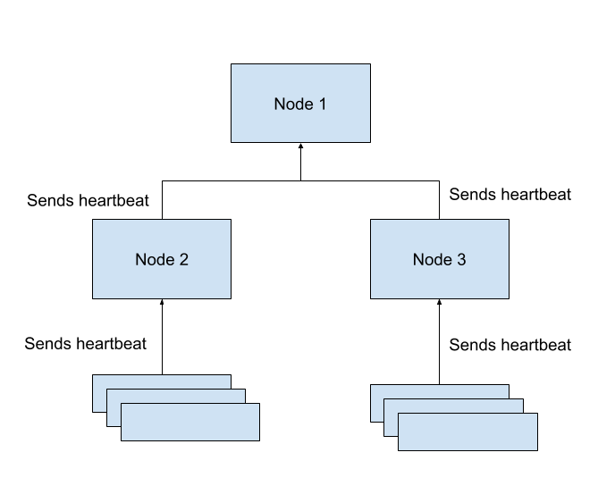

# MOSAIC: Model Orchestration & Synthesis for Adaptive Intelligent Computation

MOSAIC is an innovative open-source framework for composite learning, developed as part of the [SPRIN-D](https://www.sprind.org/) Composite Learning Challenge. MOSAIC reimagines distributed AI by orchestrating many independently trained, small-scale models—enabling efficient, robust, and scalable machine learning across heterogeneous hardware environments. It is an attempt to enable *fusion* of models that have been learned at edge into a single model, thereby enabling learning to be transferred without transfer of data itself. 


## Project Overview

**MOSAIC challenges the monolithic AI paradigm.**  
Instead of relying on massive, centralized models, MOSAIC fuses the outputs of distributed, independently trained models (pattern recognizers) into a unified, high-performing system. This approach democratizes AI, making advanced machine learning accessible and efficient across a wide range of devices and environments.

**Key Goals:**
- **Efficiency:** Achieve superior model performance with less computational resource.
- **Decentralization:** Distribute learning and inference tasks across diverse, often resource-constrained, devices.
- **Scalability & Robustness:** Dynamically adapt to changing compute resources and network conditions.


## Technical Components

MOSAIC is built around a modular, extensible architecture:

- **Independent Network Nodes:**  
  Each Mosaic node is an independent entity in the network that can function as both a workhorse (executing ML operations and computations) and a controller (where users interact with the network to issue commands). Nodes can be dynamically added or removed, allowing the system to scale and adapt to available resources.

- **Implementation Languages:**  
  MOSAIC is implemented in both Python and Java. The Python implementation is currently available and actively maintained, while the Java implementation is still in development.

- **Decentralized, Secure Architecture:**  
  Peer-to-peer connections between nodes, secured with SSL. Each node can independently participate in the network, supporting robust, fault-tolerant operations.

- **Heterogeneous Hardware Optimization:**  
  Automatic detection and utilization of available hardware (CPUs, GPUs, accelerators), with containerized deployment (Docker, Podman, Kubernetes) for seamless integration across cloud, edge, and on-premise environments.

- **Parallelization & Communication:**  
  Supports both data and model parallelization (e.g., for ResNet, GPT-Neo), with efficient, adaptive communication protocols and gradient compression to minimize network overhead.

- **Robustness & Fault Tolerance:**  
  Dynamic resource monitoring, checkpointing, and local ledgers ensure resilience to node failures and fluctuating network conditions.

- **Advanced Features:**  
  - Encryption and privacy-preserving techniques
  - MLOps integration and monitoring (Coming Soon)
  
# Understanding the Architecture



A MOSAIC network is a network of independent nodes where at least one node (such as Node 1 in the diagram above) serves as the **controller**—the point where users interact with the network to issue commands for operations like training or inference. While any node can function as both a workhorse and a controller, having a designated controller node simplifies network management and command coordination.

## Heartbeat Communication

**Heartbeats are directional** in MOSAIC. For example, in the diagram, Node 2 reports its status to Node 1, but Node 1 does not necessarily send heartbeats back to Node 2 (though this can be configured if bidirectional communication is desired).

A heartbeat serves more than just a "keep-alive" signal. Each heartbeat message includes **capability information** about the sending node, such as:
- Available GPUs and their specifications
- CPU resources and cores
- Memory capacity
- Current workload status

MOSAIC uses this capability information to intelligently calculate how to distribute workloads across the network, ensuring optimal resource utilization and performance.

*NOTE* Please be aware port blocks on the firewall, or sealed off subnets, etc, will block Mosaic nodes from connecting with one another.

## Fault Tolerance

When a node breaks down or becomes unreachable, connected nodes detect the failure through missed heartbeats. The network automatically redistributes workloads from the failed node to available nodes, ensuring continuous operation and resilience to individual node failures.

## Recommended Setup

For the simplest setup, configure your architecture as shown in the diagram: **one central node connected to many others**, with the other nodes sending heartbeats to the central node. This hub-and-spoke topology provides a clear control point while maintaining the flexibility to scale horizontally.

> **💡 Getting Started**: See the [Worked Example: 3-Node Network](#worked-example-3-node-network) section for a complete step-by-step guide on setting up a multi-node MOSAIC network.

# 👉 BEFORE YOU START: Core Requirements 

You'll need the following on every server to be able to run Mosaic:

- Docker (runs Mosaic)
- Python 3.11 or higher (only required once to create SSL certificates)

# Quick Installation Guidelines

> **📖 Quick Start**: For a complete worked example with 3 nodes, see the [Worked Example: 3-Node Network](#worked-example-3-node-network) section below.

## Download and Run

### Downloading the Docker Image

MOSAIC is distributed as a Docker container. The easiest way to get started is to pull the image from GitHub Container Registry:

```bash
docker pull --pull=always ghcr.io/manishjiva/mosaic-python:latest
```

**If the pull fails**, you can download the image as a tar file and load it manually:

```bash
# Download the tar file
wget --no-check-certificate 'https://drive.google.com/uc?export=download&id=1bk_YlJ8F07fxa8NPIVDYAk_NA3w9L6Fw' -O mosaic-python_latest.tar

# Load the image into Docker
docker load -i mosaic-python_latest.tar
```

> **⚠️ Note**: The Docker image is large (several GB) because it includes all dependencies such as PyTorch and related ML libraries. The initial download may take some time depending on your internet connection.

### Setting Up SSL Certificates

Before running MOSAIC on any machine, you need to set up SSL certificates for secure communication between nodes. Python 3.11 or higher is required for certificate generation.

**Download the certificate generation scripts:**

You can find the certificate generation scripts in the [MOSAIC repository](https://github.com/jiva-ai/mosaic) under the `mosaic-security` directory, or download them directly:

```bash
wget --no-check-certificate 'https://drive.google.com/uc?export=download&id=1GEEjBU419wForLiI6_W71aLdWvCMrSbY' -O mosaic-security.tar.gz
tar -xzf mosaic-security.tar.gz
```

**Generate certificates:**

The simplest way to generate certificates is using the provided script:

```bash
cd mosaic-security
python generate_certs.py --hostname your-server-hostname
```

This creates three files in the `certs/` directory:
- `ca.crt` - Certificate Authority certificate
- `server.crt` - Server certificate
- `server.key` - Server private key

**Set proper file permissions:**

```bash
chmod 600 certs/server.key    # Private key - read/write for owner only
chmod 644 certs/server.crt    # Server certificate - readable by all
chmod 644 certs/ca.crt        # CA certificate - readable by all
```

**Transfer certificates to all servers:**

For a multi-node setup, copy all three certificate files to the same directory location on each server (for consistency). For example:

```bash
# On your local machine, after generating certificates
scp certs/* user@node1:/home/user/mosaic/certs/
scp certs/* user@node2:/home/user/mosaic/certs/
scp certs/* user@node3:/home/user/mosaic/certs/
```

> **Important**: The certificate paths in your configuration file must point to where these three files are located on each server. See the [Configuration](#configuration) section below.

For more detailed certificate generation options and troubleshooting, see the [mosaic-security README](mosaic-security/README.md).

### Ideal Setup

For the best organization, set up your MOSAIC directory structure as follows:

```
$ ls -la

benchmarks/          # Benchmark data storage
data/                # Training and inference data
models/              # ONNX model files
plans/               # Distribution plans
state/               # Node state files
mosaic-config.json   # Configuration file (passed to run_mosaic.sh)
run_mosaic.sh        # Helper script to run the Docker container
```

This structure keeps all MOSAIC-related files organized and makes it easy to manage your deployment.

### Configuration

Create a `mosaic-config.json` file (or `mosaic.config`) with your node's configuration. Here's an example:

```json
{
  "host": "192.168.0.1",
  "heartbeat_port": 5000,
  "comms_port": 5001,
  "peers": [
    {"host": "node1.example.com", "comms_port": 5001, "heartbeat_port": 5000},
    {"host": "node2.example.com", "comms_port": 5001, "heartbeat_port": 5000}
  ],
  "heartbeat_frequency": 5,
  "heartbeat_tolerance": 15,
  "heartbeat_report_length": 300,
  "heartbeat_wait_timeout": 2,
  "stats_request_timeout": 30,
  "server_crt": "/home/user/mosaic/certs/server.crt",
  "server_key": "/home/user/mosaic/certs/server.key",
  "ca_crt": "/home/user/mosaic/certs/ca.crt",
  "benchmark_data_location": "/home/user/mosaic/benchmarks",
  "run_benchmark_at_startup": false,
  "data_location": "/home/user/mosaic/data",
  "plans_location": "/home/user/mosaic/plans",
  "models_location": "/home/user/mosaic/models",
  "state_location": "/home/user/mosaic/state",
  "data_chunk_size": 256
}
```

**Key configuration points:**

- **Certificate paths**: The `server_crt`, `server_key`, and `ca_crt` parameters must point to the actual locations of your certificate files on each server. Use fully qualified (absolute) paths to avoid confusion when copying into Docker.
- **Peers**: The `peers` array lists which nodes this node will heartbeat to. Other nodes may heartbeat to this node without being listed here (see the worked example below).
- **First run**: The very first time MOSAIC runs, it takes approximately 5 minutes to warm up. This is because MOSAIC assesses the machine's capabilities by running benchmarks on CPU, GPU, and disk. You can suppress this by setting `run_benchmark_at_startup` to `false` in the config.

For more detailed configuration information, see the [mosaic-config README](mosaic-python/mosaic_config/README.md).

### Starting MOSAIC

**Download the run script:**

You can download the `run_mosaic.sh` helper script from the [MOSAIC repository](https://github.com/jiva-ai/mosaic) or directly:

```bash
wget --no-check-certificate 'https://drive.google.com/uc?export=download&id=1GEEjBU419wForLiI6_W71aLdWvCMrSbY' -O run_mosaic.sh
chmod +x run_mosaic.sh  # Make it executable
```

**Run MOSAIC:**

```bash
# Replace mosaic-config.json with the path to your actual configuration file.
./run_mosaic.sh --config mosaic-config.json
```

For more detailed information on running MOSAIC across multiple machines, see [MULTI-MACHINE-DOCKERS.md](MULTI-MACHINE-DOCKERS.md) and the [mosaic-config README](mosaic-python/mosaic_config/README.md).

### Worked Example: 3-Node Network

This example demonstrates setting up a MOSAIC network with 3 machines, where Node 1 acts as the controller and Nodes 2 and 3 heartbeat to it.

> **⚠️ Warning**: Multiple MOSAIC Docker containers are not meant to run on the same host. Running multiple containers on a single machine can cause resource contention (CPU, memory, GPU) and hostname sharing issues. Each node in a MOSAIC network should run on a separate physical or virtual machine with its own unique hostname and IP address.

**Setup:**

1. **Node 1 (Controller)**: `192.168.1.10`
2. **Node 2**: `192.168.1.11`
3. **Node 3**: `192.168.1.12`

**Step 1: Generate and distribute certificates**

On one machine (or locally), generate the certificates:

```bash
python generate_certs.py --hostname 192.168.1.10
```

Copy all three certificate files to the same directory on each server (e.g., `/home/user/mosaic/certs/`):

```bash
# Copy to Node 1
scp certs/* user@192.168.1.10:/home/user/mosaic/certs/

# Copy to Node 2
scp certs/* user@192.168.1.11:/home/user/mosaic/certs/

# Copy to Node 3
scp certs/* user@192.168.1.12:/home/user/mosaic/certs/
```

**Step 2: Configure each node**

**Node 1 configuration** (`mosaic-config.json`):

```json
{
  "host": "192.168.1.10",
  "heartbeat_port": 5000,
  "comms_port": 5001,
  "peers": [],
  "server_crt": "/home/user/mosaic/certs/server.crt",
  "server_key": "/home/user/mosaic/certs/server.key",
  "ca_crt": "/home/user/mosaic/certs/ca.crt",
  "run_benchmark_at_startup": false,
  "data_location": "/home/user/mosaic/data",
  "plans_location": "/home/user/mosaic/plans",
  "models_location": "/home/user/mosaic/models",
  "state_location": "/home/user/mosaic/state"
}
```

Note: Node 1 has an empty `peers` array because Nodes 2 and 3 will heartbeat to it, not the other way around.

**Node 2 configuration** (`mosaic-config.json`):

```json
{
  "host": "192.168.1.11",
  "heartbeat_port": 5000,
  "comms_port": 5001,
  "peers": [
    {"host": "192.168.1.10", "comms_port": 5001, "heartbeat_port": 5000}
  ],
  "server_crt": "/home/user/mosaic/certs/server.crt",
  "server_key": "/home/user/mosaic/certs/server.key",
  "ca_crt": "/home/user/mosaic/certs/ca.crt",
  "run_benchmark_at_startup": false,
  "data_location": "/home/user/mosaic/data",
  "plans_location": "/home/user/mosaic/plans",
  "models_location": "/home/user/mosaic/models",
  "state_location": "/home/user/mosaic/state"
}
```

**Node 3 configuration** (`mosaic-config.json`):

```json
{
  "host": "192.168.1.12",
  "heartbeat_port": 5000,
  "comms_port": 5001,
  "peers": [
    {"host": "192.168.1.10", "comms_port": 5001, "heartbeat_port": 5000}
  ],
  "server_crt": "/home/user/mosaic/certs/server.crt",
  "server_key": "/home/user/mosaic/certs/server.key",
  "ca_crt": "/home/user/mosaic/certs/ca.crt",
  "run_benchmark_at_startup": false,
  "data_location": "/home/user/mosaic/data",
  "plans_location": "/home/user/mosaic/plans",
  "models_location": "/home/user/mosaic/models",
  "state_location": "/home/user/mosaic/state"
}
```

**Step 3: Start MOSAIC on each server**

On each server, run:

```bash
./run_mosaic.sh --config mosaic-config.json
```

**That's it!** Your 3-node MOSAIC network is now running. MOSAIC runs as a REPL (Read-Eval-Print Loop) - type `help` to see available commands.

### Training and Inference

MOSAIC runs as an interactive REPL (Read-Eval-Print Loop). When you start MOSAIC, you'll see a command prompt where you can issue commands.

**Assumptions:**

- Some nodes in the network may not have a copy of the training data
- In our worked example above, assume Node 1 has the data in its `data_location` directory

**Starting training:**

1. Connect to Node 1's REPL (the controller node)
2. Place your training data in Node 1's `data_location` directory
3. Issue the `train` command and follow the step-by-step instructions

**Starting inference:**

1. Connect to any node's REPL
2. Issue the `infer` command and follow the step-by-step instructions

The MOSAIC system will automatically distribute workloads across available nodes based on their capabilities.

### Warnings

**⚠️ Known Issue - WSL/Ubuntu Windows Docker:**

WSL (Windows Subsystem for Linux) with Docker on Windows is known to hang and is currently not supported. If you're using WSL, it's better to use the raw Python implementation and run with UV:

```bash
# Install UV if not already installed
pip install uv

# Run MOSAIC with UV
uv run python -m mosaic <your-command>
```

For production deployments, use native Linux servers or cloud instances.


## Requirements

### System Requirements
- **Operating System**: Linux (recommended), Unix-like systems
- **Network**: TCP/UDP ports for communication (default: 5000 for heartbeats, 5001 for general communications)
- **SSL/TLS**: Python's built-in `ssl` module (no additional installation required)
- **Memory**: Sufficient RAM for model loading and inference (varies by model size)
- **Storage**: Space for models, data, and state files (varies by use case)

### GPU Support
If you plan to use GPU acceleration (which are usually installed when you run these servers from a cloud provider):
- **NVIDIA**: CUDA-compatible GPU with appropriate CUDA drivers installed
- **AMD**: ROCm-compatible GPU with ROCm drivers installed
- **Intel**: Intel GPU with appropriate drivers
- **Habana**: Habana Gaudi accelerator with appropriate drivers

GPU libraries (CUDA, cuDNN, etc.) are automatically included with PyTorch when installed with GPU support.


## Contributors and Acknowledgements

**Lead Institution & Development Team:**  
Jiva.ai Ltd., Tramshed Tech, Pendyris Street, Cardiff, Wales, CF11 6BH

**Special Thanks:**  
The MOSAIC project is proudly supported by [SPRIN-D](https://www.sprind.org/), the German Federal Agency for Disruptive Innovation. SPRIN-D’s Composite Learning Challenge funds pioneering research and development in distributed, decentralized, and robust AI systems. Their support enables us to push the boundaries of what’s possible in democratized, efficient, and secure machine learning. It is thanks to their initial funding that enabled the Jiva.ai team to create the first iteration of this project. 

Thank you to SPRIN-D and its mentors, as well as all contributors for making MOSAIC possible.

---

*This README is a living document and will be updated as the project evolves.*

